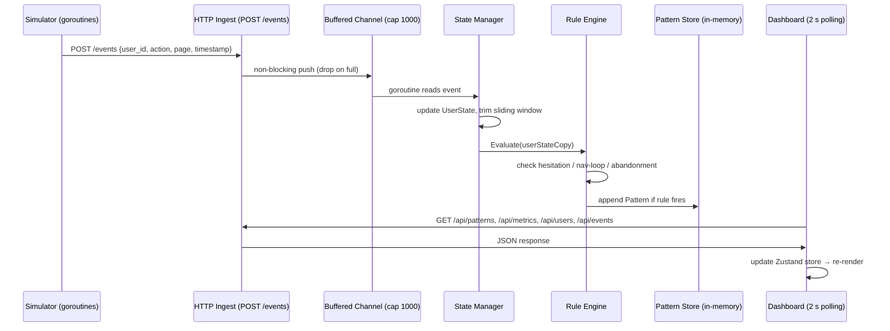

# BehaviorLens

**Real-time user behavior observability for modern web applications.**

BehaviorLens detects and explains friction signals as they happen — hesitation, navigation loops, and checkout abandonment — by processing a continuous stream of browser events through a stateful rule engine and surfacing the results on a live dashboard.

---

## Problem Statement

Most analytics tools answer *what* happened: page views, click-through rates, conversion funnels. They cannot tell you *why* a user stopped mid-checkout, why they looped through the same search page four times, or how long they stared at a product before giving up.

BehaviorLens fills that gap. By operating on a raw event stream at millisecond granularity, it classifies in-progress user sessions into behavioral patterns and generates plain-English explanations — without waiting for a session to end or a data warehouse to refresh.

---

## Architecture

### Event Flow



---

## Pattern Detection Logic

### Hesitation

**Trigger:** A user remains on the same page for more than 10 seconds without any non-idle action.

| Idle duration | Severity |
|---|---|
| 10 – 15 s | Low |
| 15 – 30 s | Medium |
| > 30 s | High |

Deduplication: a hesitation pattern will not re-fire for the same user + page within 60 seconds, and is suppressed while an unresolved hesitation pattern exists for that user + page.

**Explanation template:** `User paused for N seconds on /page without taking action.`

---

### Navigation Loop

**Trigger:** The same page is visited 3 or more times within a 2-minute sliding window.

| Visit count | Severity |
|---|---|
| 3 | Medium |
| 4+ | High |

Deduplication: suppressed while an unresolved navigation-loop pattern exists for that user + page.

**Explanation template:** `User navigated to /page N times within 2 minutes, suggesting confusion or indecision.`

---

### Abandonment

**Trigger:** A user navigates to `/cart` or `/checkout` and does not fire a `complete` or `confirm` action within 60 seconds.

Severity: always **High**.

A per-user goroutine starts a 60-second timer on cart/checkout entry. The timer is cancelled if a completion event arrives first. Any active abandonment patterns are resolved when the user completes.

**Explanation template:** `User entered the checkout flow on /page but did not complete the transaction within 60 seconds.`

---

## Local Development

### Prerequisites

- Go 1.21+
- Docker + Docker Compose
- Node 20+

### 1 — Start the Go backend

```bash
docker compose up --build
```

The backend listens on `http://localhost:8080`. The event simulator starts automatically inside the container — live data appears within seconds, no manual steps required.

### 2 — Start the frontend

```bash
npm install
```

Add the backend URL to your local environment:

```bash
echo 'PUBLIC_BACKEND_URL=http://localhost:8080' >> .env.local
```

Then start the dev server:

```bash
npx wix dev
```

Navigate to `/dashboard` to see the live BehaviorLens dashboard.

### Backend endpoints

| Method | Path | Description |
|---|---|---|
| `POST` | `/events` | Ingest a behavioral event |
| `GET` | `/api/patterns` | Detected patterns (newest first, `?limit=N`) |
| `GET` | `/api/metrics` | System-wide aggregates |
| `GET` | `/api/users` | Active users (seen in last 30 s) |
| `GET` | `/api/events` | Recent raw events (`?limit=N`) |
| `GET` | `/health` | Liveness probe |

### Event schema

```json
{
  "user_id": "user-1234",
  "action": "navigate",
  "page": "/checkout",
  "timestamp": 1700000000000,
  "metadata": {}
}
```

Valid actions: `click`, `scroll`, `idle`, `navigate`, `abandon`, `complete`, `confirm`.

---

## Scalability

The current implementation is an intentionally minimal in-process MVP. The following architectural changes unlock production scale:

### State: Redis instead of in-memory maps

Replace `map[string]*UserState` with Redis hashes keyed by `user_id`. This makes the state manager stateless, allowing multiple backend instances to process the same user stream. Redis Streams replace the buffered Go channel for durability and consumer group semantics.

### Backpressure: Kafka between ingest and processing

Insert a Kafka topic between `POST /events` and the state manager. Each partition maps to a subset of user IDs, providing natural ordering guarantees per user. Consumer groups allow horizontal scaling of the rule engine without coordination overhead.

### Sharding: user_id-based routing

Shard event ingestion by `hash(user_id) % num_partitions`. All events for a given user land on the same partition, ensuring the sliding window logic remains consistent without cross-shard coordination or distributed locks.

### History: time-series database

Replace the in-process pattern slice with a time-series database (TimescaleDB or ClickHouse). This enables historical trend analysis, long-term pattern retention, and dashboard queries spanning weeks or months. The in-memory pattern slice becomes a hot cache for the last few minutes only.

---

## Technology Decisions

**Why Go for the backend?**
Go's goroutine model maps directly to the problem: thousands of concurrent per-user timers (abandonment detection), a persistent event-processing goroutine, and a low-latency HTTP layer — all without a thread-per-connection runtime overhead. The standard library covers every networking and concurrency primitive required; zero external dependencies.

**Why in-memory state for the MVP?**
In-memory maps with a `sync.RWMutex` provide sub-microsecond read latency and eliminate operational dependencies during development. The abstraction boundary between `StateManager` and `RuleEngine` is designed so that a Redis-backed implementation is a near drop-in replacement.

**Why rule-based detection instead of ML?**
Rule-based logic is fully interpretable, deterministic, and requires zero training data. Each pattern maps directly to a business-meaningful threshold (10 s idle = hesitation) that a product team can inspect, debate, and tune without a data science team. ML is the right next step once baseline patterns are validated against real session data.

**Why polling instead of Server-Sent Events (SSE)?**
Polling at 2-second intervals is simpler to operate (works through any CDN or load balancer, no persistent connection management, trivial to reason about under load) and sufficient for human-visible update latency. The SSE upgrade path is straightforward: replace the Zustand `setInterval` with an `EventSource` connection to a `GET /api/stream` endpoint on the backend, using `text/event-stream` responses.
